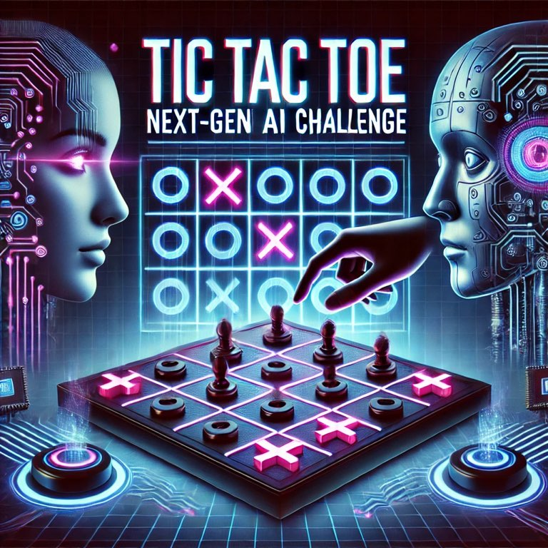

This project aims to create a complete Tic-Tac-Toe-computer with Machine Learning using the Monte Carlo Tree search algorithm to create and search through a binary search tree to find the best moves in any position.
Contributors: Franz, Kolja, Jasmin, Felix

Comments in German, deal with it 😎.
